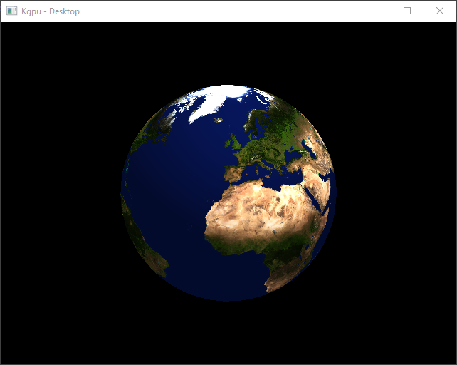

# Kgpu

A Cross Platform Graphics API For Kotlin JVM/JS

 __Requirements:__

- JDK 11

 __Supported Platforms:__

- Windows 10
- MacOS (See [Issue #1](https://github.com/kgpu/kgpu/issues/1))
- Linux
- Chrome Canary
- Firefox Nightly

## Links

[__Kgpu Book__](https://kgpu.github.io/kgpu)

[__Documentation__](https://kgpu.github.io/kgpu/dokka/-modules.html)

[__Live Example__](https://kgpu.github.io/kgpu/examples/index.html)

## Modules

kgpu is split into multiple modules:

- __kgpu:__ The core of this library (Kotlin bindings to WebGPU)
- __kcgmath:__  A cross platform graphics library for Kotlin based
on the Rust crate [cgmath](https://crates.io/crates/cgmath)
- __kshader:__ A library to help compile GLSL to SPIR-V

## Images



## Examples

To run the examples on Desktop:

```bash
gradlew runTriangleExample
gradlew runCubeExample
gradlew runTextureExample
gradlew runEarthExample
```

To run the examples on the Web:

```bash
gradlew buildWeb startWebServer
```

Then navigate to [http://localhost:8080/index.html](http://localhost:8080/index.html)

## Getting Started
To get started, see the [Getting Started Page](https://kgpu.github.io/kgpu/getting_started.html)
in the Kgpu book
