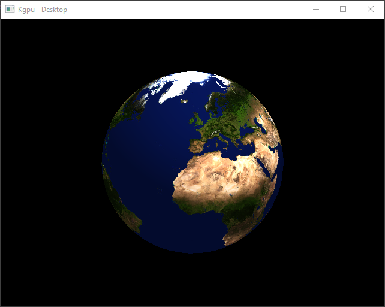

# Kgpu
A Cross Platform Graphics API For Kotlin JVM/JS
 
 __Requirements:__
 - JDK 11 
 
 __Supported Platforms:__
- Windows 10 
- MacOS (See [Issue #1](https://github.com/kgpu/kgpu/issues/1))
- Linux
- Chrome Canary
- Firefox Nightly

## Links

[__Documentation__](kgpu/index.html)

[__Live Example__](examples/index.html)

## Images


## Examples
To run the examples on Desktop: 
```bash
gradlew runTriangleExample
gradlew runCubeExample
gradlew runTextureExample
gradlew runEarthExample
```

To run the examples on the Web:
```
gradlew buildWeb startWebServer
```
Then navigate to [http://localhost:8080/index.html](http://localhost:8080/index.html)

### How to add to Gradle (Kotlin DSL)
First you need to add the snapshots repository:
```kotlin
repositories {
    maven(url = "https://oss.sonatype.org/content/repositories/snapshots/")
}
```

Then you can add the dependency:
```kotlin
dependencies {
    //Add it to a kotlin multiplatform project
    implementation("io.github.kgpu:kgpu:0.1.0-SNAPSHOT")

    //Or you can add a specific platform
    implementation("io.github.kgpu:kgpu-common:0.1.0-SNAPSHOT")
    implementation("io.github.kgpu:kgpu-js:0.1.0-SNAPSHOT")
    implementation("io.github.kgpu:kgpu-jvm:0.1.0-SNAPSHOT")
}
```